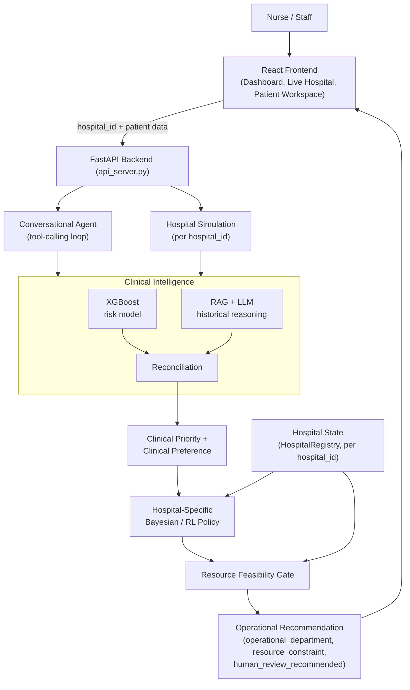
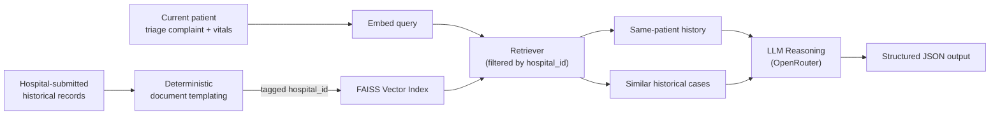
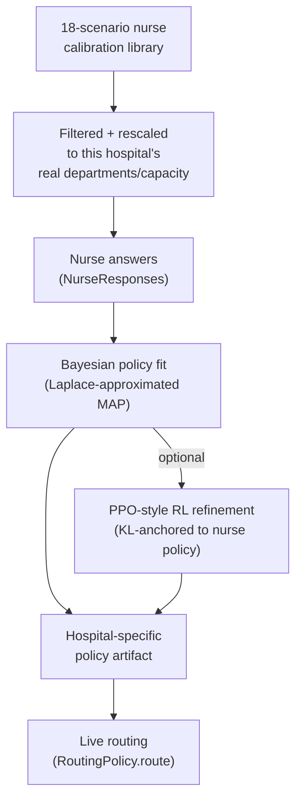
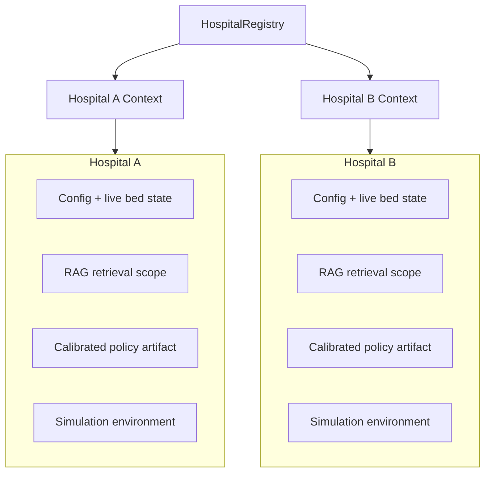
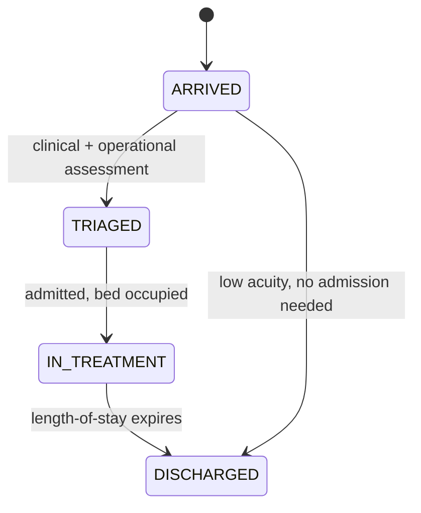

# TriageGuard

## AI-Powered Clinical Triage and Hospital Resource Routing

TriageGuard combines quantitative clinical risk modeling, historical case reasoning, and hospital-specific operational calibration to help emergency departments decide **what a patient clinically needs** and **where they can actually be placed right now** — for one hospital or many, at the same time.

---

## Table of Contents

- [1. Overview](#1-overview)
- [2. Problem Statement](#2-problem-statement)
- [3. Solution Overview](#3-solution-overview)
- [4. Key Features](#4-key-features)
- [5. System Architecture](#5-system-architecture)
- [6. Clinical Intelligence](#6-clinical-intelligence)
- [7. RAG Pipeline](#7-rag-pipeline)
- [8. Adaptive Hospital Routing](#8-adaptive-hospital-routing)
- [9. Multi-Hospital Architecture](#9-multi-hospital-architecture)
- [10. Dynamic Hospital Simulation](#10-dynamic-hospital-simulation)
- [11. Frontend / Nurse Experience](#11-frontend--nurse-experience)
- [12. Backend / API](#12-backend--api)
- [13. End-to-End Workflow](#13-end-to-end-workflow)
- [14. Safety, Reliability & Fallbacks](#14-safety-reliability--fallbacks)
- [15. Technology Stack](#15-technology-stack)
- [16. Testing & Validation](#16-testing--validation)
- [17. Setup & Running](#17-setup--running)
- [18. Limitations & Future Scope](#18-limitations--future-scope)
- [19. Conclusion](#19-conclusion)

---

## 1. Overview

TriageGuard is a decision-support system for emergency department triage and bed allocation. It does not diagnose or treat patients — it takes the information already available at triage time and produces two distinct, clearly separated answers for clinical staff:

1. **What does this patient clinically need?** (a department preference, driven by a quantitative risk model and historical case reasoning)
2. **Where can they actually go right now, at this specific hospital?** (a resource-aware allocation, driven by that hospital's calibrated preferences and its real-time bed state)

The system is built to operate across **multiple independent hospitals** from a single deployment, each with its own configuration, occupancy, historical case data, and calibrated routing behavior.

## 2. Problem Statement

Emergency departments face two coupled but distinct problems:

- **Clinical**: given incomplete, evolving information, how urgent is this patient, and what level of care do they need?
- **Operational**: given the hospital's actual current capacity, where can that patient safely and immediately be placed?

Static rule-based triage systems typically only address the first problem, and hand-built resource logic is usually hospital-specific and brittle. A useful system must keep these two questions structurally separate — a full ICU does not make a patient less sick, but it does change where they can go — and must scale to more than one facility without duplicating logic per hospital.

## 3. Solution Overview

TriageGuard answers the clinical question with two complementary models — a compact **XGBoost** risk engine for quantitative, missing-data-aware prediction, and a **RAG + LLM** branch that reasons over the patient's own history and similar historical cases. Their outputs are reconciled into a single confidence-weighted clinical priority.

That clinical priority is then handed to an **adaptive routing layer**: a Bayesian policy calibrated from a hospital's own nurses answering a curated set of resource-allocation scenarios, refined where useful with a lightweight PPO-style RL step. This policy, combined with the hospital's live bed state, produces the actual operational recommendation — subject to a hard feasibility gate that never allows an unavailable department to be selected.

Every layer of this pipeline — historical retrieval, calibration data, routing policy, and simulated hospital state — is scoped by `hospital_id`, so Hospital A and Hospital B can be onboarded, configured, and operated independently within the same running system.

## 4. Key Features

- **Dual clinical models** — calibrated XGBoost risk (ICU risk at 2h/6h/12h, admission risk, confidence) alongside RAG-retrieved historical case reasoning from an LLM.
- **Confidence-weighted reconciliation** — the two branches are blended by how confident each one actually is, not by how much raw data happens to be present; disagreement can only escalate risk, never suppress it.
- **Nurse-calibrated routing** — a reusable library of clinical/resource scenarios, automatically filtered and rescaled to each hospital's real departments and bed counts, drives a Bayesian behavior-cloning policy per hospital.
- **RL refinement** — an optional PPO-style policy-gradient step, warm-started from and KL-anchored to the nurse-calibrated policy, trained inside a hospital-scoped simulation.
- **Hard resource feasibility** — a policy preference can never result in allocation to a closed or fully-occupied department; a genuine resource conflict is surfaced explicitly for human review rather than silently overridden.
- **True multi-hospital isolation** — independent configuration, live bed state, historical-case retrieval, calibration data, and routing policy per `hospital_id`, coexisting in one process.
- **Dynamic hospital simulation** — a simulated ED with patient arrivals, length-of-stay-based discharge, and event history, usable per hospital for demos, testing, and RL training.
- **Nurse-controlled department queues** — patients are grouped by department, reorderable by drag-and-drop, and can be deliberately moved to a different department as an explicit nurse override — always subject to the same feasibility checks as automated routing.
- **AI recommendation vs. operational reality, always distinguishable** — the UI never collapses "what the model recommends" and "where the patient currently sits" into one value; a nurse override is visibly different from the AI's own recommendation, not silently merged into it.
- **Conversational + dashboard frontend** — a nurse-facing chat agent and a Live Hospital operational view, both hospital-selection aware.

## 5. System Architecture



## 6. Clinical Intelligence

XGBoost and the RAG/LLM branch are deliberately complementary rather than redundant:

| | XGBoost | RAG + LLM |
|---|---|---|
| Question answered | "What is the quantitative risk given current vitals/history?" | "What does this patient's own history and similar past cases suggest?" |
| Output | Calibrated probabilities: `icu_risk_2h/6h/12h`, `admission_risk`, per-target confidence | Structured JSON: `urgency`, `evidence_strength` (1-5), `escalation_concern`, `trajectory_assessment`, supporting evidence |
| Handles missing data via | Explicit missingness indicators + an `information_completeness` score | Whatever historical evidence retrieval actually returns |
| Never does | Reason about longitudinal case history | Output a numeric risk probability or decide the final department |

Neither branch is discarded when the other is weak — `reconciler.py` blends both using **each branch's own confidence** (`Cx` for XGBoost, `Cr = evidence_strength / 5` for RAG), so a confident XGBoost prediction is not diluted just because a few vitals are missing, and a hospital branch disagreement or an explicit escalation concern can only ever push the combined risk **up**, never down.

## 7. RAG Pipeline



- Historical records are converted into documents by deterministic code (never LLM-generated) and embedded with a pretrained sentence-transformer into a local FAISS index.
- Retrieval returns up to a handful of the patient's own prior visits and similar cases from other patients — never dozens of documents.
- **Hospital isolation**: every ingested document is tagged with the hospital it came from; retrieval filters on that tag, so one hospital's historical cases can never inform another hospital's reasoning (documents ingested before this scoping existed default to the base "default" hospital, preserving prior behavior).
- The LLM reasons over the retrieved evidence and returns a structured assessment — including a self-rated `evidence_strength` — but never a numeric probability and never the final department decision.

## 8. Adaptive Hospital Routing



- A single, reusable library of 18 hand-designed clinical/resource scenarios covers urgency, model agreement, confidence, and resource-pressure ladders. For each hospital, scenarios requiring a department that hospital doesn't have are automatically excluded, and bed counts are rescaled onto that hospital's real capacity while preserving each scenario's clinical intent (a fully-occupied department stays fully occupied).
- A nurse's answers to this hospital-specific scenario set fit a **Laplace-approximated Bayesian linear policy** — an appropriately lightweight method for the handful of demonstrations available, rather than a conventional model that would overfit.
- Where useful, that policy is refined with a **lightweight PPO-style policy-gradient step**, initialized from and KL/behavior-cloning-anchored to the nurse policy, trained inside a hospital-scoped simulated environment — never allowed to drift arbitrarily from the nurse's calibration.
- The fitted policy, combined with the hospital's live bed state, produces department-specific scores; a **hard safety layer** then selects the best-scoring *feasible* department, or explicitly reports a resource conflict if none exists — a policy can never cause an allocation to a closed or full department.

## 9. Multi-Hospital Architecture

Every operational layer is keyed by `hospital_id`, resolved through one `HospitalRegistry`:



| Layer | Isolation mechanism |
|---|---|
| Configuration & departments | Each hospital has its own `hospital_config.json`-shaped config; a hospital missing a department (e.g. no CICU) never receives scenarios or routing options requiring it. |
| Live bed state | A dedicated `HospitalStateService` per hospital; occupancy changes in one never touch another's. The original single-hospital deployment is preserved as the reserved `"default"` hospital. |
| Historical retrieval (RAG) | FAISS retrieval filtered by the document's `hospital_id` tag. |
| Routing policy | Bayesian/RL artifacts saved under `data/routing_policy/<hospital_id>/`, never a shared global file, never overwriting another hospital's calibration. |
| Simulation | Each `HospitalSimulator` owns its own event engine, patient queue, and bed state; two hospitals' simulations run independently in the same process. |

A request always carries `hospital_id` from the frontend through the API, the clinical pipeline, the routing policy, and the simulated hospital state — so hospital identity is never silently dropped along the way.

## 10. Dynamic Hospital Simulation

Rather than a static, manually-edited hospital state, TriageGuard models a running ED per hospital:



- Patients arrive (auto-generated per scenario rate, or manually triggered/entered by staff), are triaged through the real clinical pipeline, and — once admitted — occupy a bed for a simulated length of stay before automatic discharge releases it.
- The simulation clock can be stepped manually (useful for a controlled demo) or advanced automatically.
- A live event feed (arrivals, capacity warnings, discharges, scenario changes) makes the hospital's state changes visible rather than opaque.
- The default hospital loads with a pool of pre-simulated patients per scenario so a demo has an immediately populated, realistic queue without waiting for organic arrivals; newly onboarded hospitals start with an empty queue and are populated only by their own real arrivals/manual intake.
- Preset scenarios (Normal Day, Busy Day, Surge, Resource-Constrained) let the same hospital be demonstrated under different pressure levels.

## 11. Frontend / Nurse Experience

The frontend is a small React application built around operational clarity rather than exhaustive controls:

- **Hospital Selector** — every session is scoped to one hospital; switching hospitals switches which state, queue, and policy the rest of the UI reflects.
- **Dashboard** — a landing view summarizing hospital load and recent activity.
- **Live Hospital** — the operational heart of the app:
  - Department occupancy gauges and simulation controls (advance time, trigger arrivals, change scenario).
  - A **waiting queue** and **per-department triaged queues**, each independently reorderable by drag-and-drop.
  - **Cross-department override** — a nurse can move a triaged patient into a different department queue than the one AI/operational routing placed them in. The move is checked against the same feasibility rules as automated routing (an unknown, closed, or full department rejects the move) and can carry a short note explaining the reason.
  - Each patient card shows the **clinically preferred department** and the **current operational department** side by side, with a visual flag whenever they diverge (resource constraint) — so a nurse override versus an AI recommendation is always visually distinguishable, never silently merged into one value.
- **Patient List / Patient Workspace** — per-patient clinical detail, assessment results, and a routing panel that explicitly separates the clinical recommendation from the resource-checked allocation ("this does not mean the patient is less urgent — the department remains clinically indicated").
- **Manual Intake Form** — lets staff add a patient into the live queue directly, rather than only via simulated arrivals.
- **Chat Dock** — the conversational agent, for natural-language patient queries, reassessment requests, and explanations, with a confirmation modal (`PendingActionModal`) gating any write action (new observation, bed change, admission) behind explicit staff approval.

Throughout, the UI is built to surface the **operational** recommendation (`operational_department`) as the actionable answer, with the underlying clinical preference, any resource constraint or human-review flag, and (where a nurse has overridden the AI's placement) the AI's original recommendation all kept visible for context — not to expose raw model internals.

## 12. Backend / API

`api_server.py` is a FastAPI layer over the existing agent/pipeline code — it does not reimplement any clinical or routing logic.

| Category | Endpoints |
|---|---|
| Health / hospitals | `GET /api/health`, `GET /api/hospitals` |
| Conversational agent | `POST /api/session`, `GET /api/session/{id}`, `POST /api/chat`, `POST /api/tools/execute`, `POST /api/tools/confirm` |
| Patients | `GET /api/patients`, `GET /api/patients/{id}`, `POST /api/patients/{id}/assess` |
| Hospital state | `GET /api/hospital/state` |
| Simulation | `GET /api/simulation/scenarios`, `GET /api/simulation/dashboard`, `POST /api/simulation/scenario`, `POST /api/simulation/step`, `POST /api/simulation/arrival`, `POST /api/simulation/manual-arrival`, `POST /api/simulation/triage/{id}`, `POST /api/simulation/admit` |
| Queue control | `POST /api/simulation/queue/reorder` (waiting queue), `POST /api/simulation/queue/reorder-department` (drag-and-drop within a department's triaged queue), `POST /api/simulation/queue/override` (move a patient to a different department — a deliberate nurse override, feasibility-checked and notable) |

`hospital_id` is accepted throughout this surface (selected hospital in the frontend session, or passed explicitly per request) and threaded down into the clinical pipeline, the routing policy, and the simulation layer exactly as described in [Section 9](#9-multi-hospital-architecture).

## 13. End-to-End Workflow

1. A nurse selects **Hospital A** in the frontend and opens the Live Hospital view.
2. A patient arrives (simulated or manually entered) with a chief complaint and available vitals.
3. The backend runs XGBoost and the RAG/LLM branch in parallel, reconciles them into a clinical priority and a clinical department preference.
4. Hospital A's calibrated Bayesian/RL policy scores the candidate departments using Hospital A's own live occupancy.
5. The feasibility gate checks real bed availability: if the clinically preferred department is full, the best-scoring *available* alternative is chosen instead — or, if nothing is feasible, the system reports a resource conflict rather than guessing.
6. The nurse sees the operational recommendation, the clinical reasoning behind it, and — if applicable — why it differs from the clinical preference.
7. Running the identical patient against **Hospital B** (different configuration, different occupancy, different calibration) can produce a different operational recommendation, while the underlying clinical assessment stays the same.

## 14. Safety, Reliability & Fallbacks

- **Resource feasibility is a hard gate**, not a preference — an unavailable or closed department can never be the final allocation.
- **No fabricated allocation** — when no candidate department is both clinically acceptable and available, the system returns an explicit resource-conflict state (`operational_department = null`, `human_review_recommended = true`) instead of guessing.
- **Asymmetric escalation** — branch disagreement or an explicit RAG escalation concern can only raise the reconciled clinical risk, never lower it.
- **Policy fallback** — a hospital with no calibrated policy yet automatically falls back to the plain clinical preference, so onboarding a new hospital never breaks routing.
- **Default-hospital backward compatibility** — the original single-hospital deployment is preserved as the reserved `"default"` hospital; omitting `hospital_id` anywhere in the stack behaves exactly as it did before multi-hospital support existed.
- **Human-in-the-loop writes** — every state-changing action (new patient observation, hospital occupancy change, patient admission) requires explicit staff confirmation before it is committed.
- **Nurse overrides are feasibility-checked too** — moving a patient to a different department queue is rejected if that department is unknown, closed, or full; an override is a deliberate operational decision, not a way to bypass resource reality.
- **Validated nurse calibration** — a nurse's chosen department for a scenario is validated against that scenario's actual candidate set before it can influence policy fitting.

TriageGuard is a decision-support prototype. It does not perform autonomous diagnosis, does not replace clinical judgment, and is not presented as validated for production clinical deployment.

## 15. Technology Stack

| Layer | Technology |
|---|---|
| Clinical risk model | XGBoost, scikit-learn, joblib |
| Text embeddings | sentence-transformers (MiniLM) |
| Vector retrieval | FAISS |
| LLM reasoning & agent | OpenRouter API (model-agnostic), custom tool-calling loop |
| Routing policy | PyTorch (Laplace-approximated Bayesian linear policy; lightweight PPO-style policy gradient) |
| Backend API | FastAPI, Uvicorn |
| Frontend | React 19, TypeScript, Vite, Tailwind CSS, React Router |
| Testing | pytest |
| Data formats | JSON-based configuration and artifacts throughout (no database) |

## 16. Testing & Validation

The suite currently totals **366 collected tests** across the clinical pipeline, RAG, routing/policy, agent runtime, hospital registry/isolation, and multi-hospital simulation:

- **360 passing.**
- **6 known failing**, none of which are caused by the multi-hospital/routing work described in this document:
  - 4 pre-date this work and are caused by a tracked test fixture (`triageguard_agent/data/patients/52.json`) having been overwritten by a manual interactive session, drifting from the value its own tests expect.
  - 2 stem from the default hospital now loading pre-simulated demo patients by default (see [Section 10](#10-dynamic-hospital-simulation)), which two older tests (written before that feature existed) assume is an empty queue at construction.

Meaningful coverage specific to this work includes:
- Multi-hospital state, RAG-retrieval, and simulation **isolation** tests (mutating one hospital never affects another; identical patient IDs across hospitals never collide).
- Hospital-specific Bayesian/RL policy fitting and artifact storage tests (different nurse calibration → different policy weights; artifacts never collide between hospitals).
- Live-routing integration tests proving the same clinical patient can receive different operational recommendations at two differently-configured, differently-occupied hospitals, and that an infeasible department is never surfaced as the final answer.
- Regression coverage confirming default/single-hospital behavior is unchanged when `hospital_id` is omitted.
- Non-default hospitals starting with an empty patient queue (no shared demo-pool leakage), and pre-simulated demo-patient records never aliasing shared state between separate builds of the same template patient.

No performance or accuracy numbers for the XGBoost/RAG models themselves are claimed here beyond what the pipeline structurally guarantees (calibration, missingness-awareness) — the underlying models were trained on a small demonstration dataset, not a clinically validated one.

## 17. Setup & Running

**Prerequisites**: Python (with a virtual environment), Node.js, and an OpenRouter API key.

```bash
# 1. Environment
cp .env.example .env
# edit .env and set OPENROUTER_API_KEY

# 2. Backend dependencies (no single root manifest yet — install per module)
pip install -r triageguard_xgb/requirements.txt
pip install -r triageguard_rag/requirements.txt
pip install fastapi uvicorn torch faiss-cpu python-dotenv httpx

# 3. Run the backend API
python -m uvicorn api_server:app --reload --port 8000

# 4. Frontend
cd frontend
npm install
npm run dev
```

The frontend dev server proxies API calls to the backend; open the printed local URL and select a hospital to begin.

To use the conversational agent from a terminal instead of the frontend:

```bash
python scripts/chat_with_agent.py
```

## 18. Limitations & Future Scope

- **RL is not yet part of live routing.** The Bayesian policy drives live, per-hospital routing today; the PPO-style RL refinement is implemented and hospital-scoped, but is a separate, explicitly-invoked training step, not yet wired into the live request path.
- **No consolidated dependency manifest.** Backend dependencies are currently split across per-module `requirements.txt` files plus a few ungrouped packages (FastAPI, PyTorch, FAISS) required by the agent/router/API layers.
- **Simulation scenario capacities are hospital-agnostic.** Loading a preset scenario (e.g. "Busy Day") currently applies that scenario's own canonical bed counts to whichever departments a hospital has, rather than rescaling to that hospital's actual configured capacity the way calibration scenarios already do.
- **XGBoost/RAG models are demonstration-scale**, trained on a small dataset for prototype purposes, not clinically validated.
- **Nurse calibration responses are currently developer-authored placeholders** for the scenario library's baked-in defaults; real per-hospital deployment assumes actual clinical staff answer the calibration set.

## 19. Conclusion

TriageGuard demonstrates that clinical risk assessment and hospital operational routing can be built as genuinely separable concerns — a quantitative model and a historical-reasoning model produce a clinical picture that never changes with bed availability, while a hospital-specific, nurse-calibrated policy decides allocation under a hard safety gate. That separation, combined with a `hospital_id` boundary threaded consistently through configuration, state, retrieval, calibration, and routing, lets the same engineering effort serve one hospital or many without duplicating logic — the core requirement for a system meant to generalize beyond a single deployment.

## 20. Dataset Used

Our model is trained on real world patient from data of MIMIC IV
